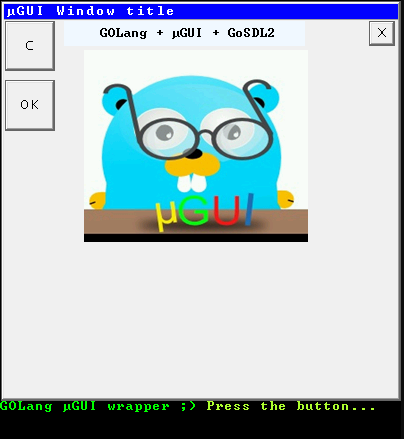

### **GOUGUI** wrapper arround **µGUI** the *"Open Source GUI module for embedded systems"*

GOGUI is made using another package [c-forg-go](https://github.com/xlab/c-for-go).

Example screen off application with can be downloaded from relase section looks like this:

Package is curently tested on Windows platform but should work also on Linux and MacOS.

To get package simple use: \
`` go get github.com/grzesl/gougui  ``

The oryginal package of *µGUI* was little modified to pass c-for-go requierments.

Example code:

    ug.UG_Init(&maingui, UserPixelSetFunction, LCD_1IN14_WIDTH, LCD_1IN14_HEIGHT)
	ug.UG_SelectGUI(&maingui)

	ug.UG_FontIdSelect(ug.FONT_ID_8X12)

	ug.UG_WindowCreate(&window1, obj, MAX_OBJECTS, window_1_callback)

	ug.UG_WindowSetTitleTextFont(&window1, ug.FONT_ID_8X12)
	ug.UG_WindowSetTitleText(&window1, "Hello world")
	ug.UG_WindowResize(&window1, 1, 1, 400, 400)

	ug.UG_WindowShow(&window1) 

**Licensed** under MIT.